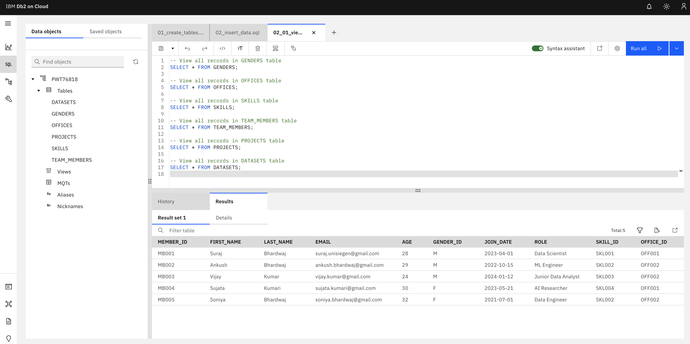
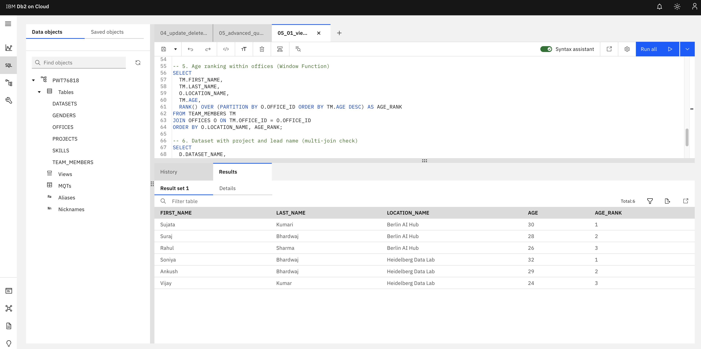
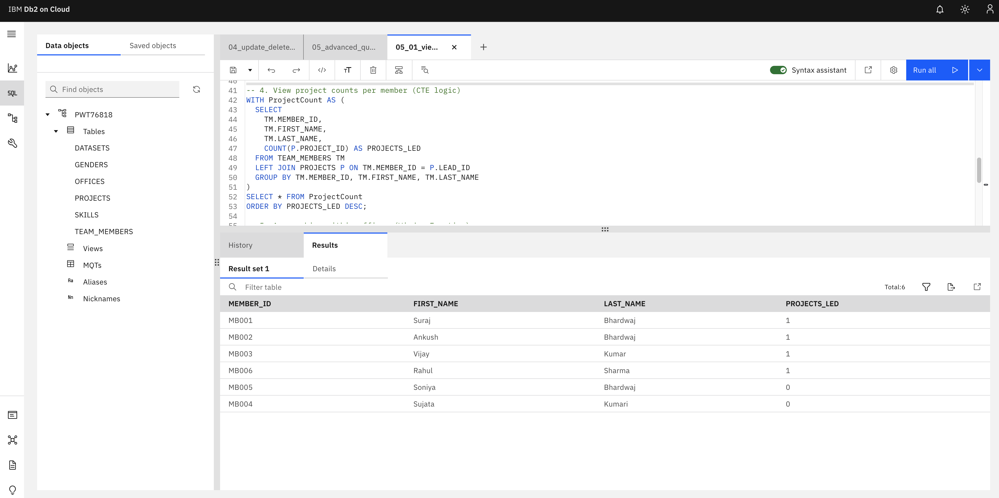
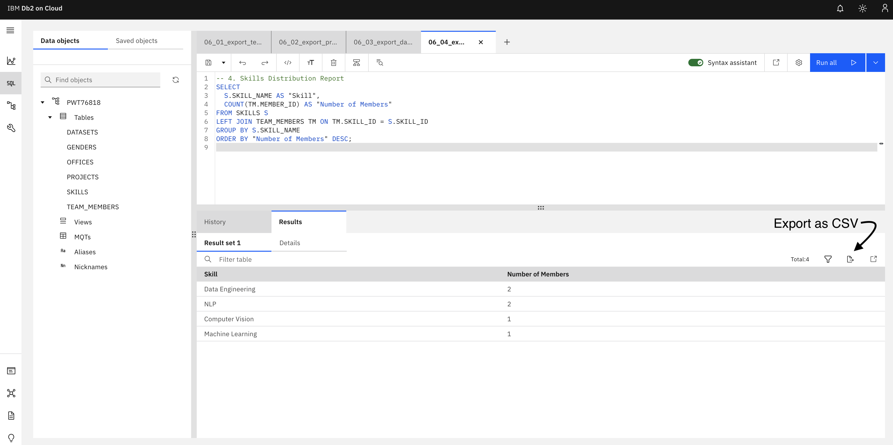

# Data Science Team Management: (IBM Db2 Cloud and SQL Project)

## Title: Relational Database Design & Analysis for Data Science Team Management  
**Database**: IBM Db2 on Cloud (Lite Plan)  
**Author**: Suraj Bhardwaj  
**Email**: suraj.unisiegen@gmail.com  

---

## 1. Introduction

This project demonstrates the design, implementation, and querying of a normalized relational database system for managing a data science team in a research or enterprise setting. Built on IBM Db2 Cloud (Lite plan, 200MB limit), it simulates real-world operational entities such as team members, projects, datasets, skills, offices, and organizational metadata.

The system is built using standard SQL and adheres to best practices in schema design, integrity constraints, indexing, normalization, and query optimization. It also demonstrates advanced SQL techniques including joins, CTEs, window functions, and data export preparation.

---

## 2. Objectives

- Design a normalized, scalable relational schema for managing data science operations
- Populate realistic data simulating a functional environment
- Apply advanced SQL operations for analytics and reporting
- Enable export of tabular data for dashboards, reports, or external tools
- Demonstrate compatibility with IBM Db2 Cloud services (Lite plan)

---

## 2.1 Project Structure

| Folder         | Contents                                |
|----------------|------------------------------------------|
| `sql/`         | All SQL scripts for creating, querying, updating, and exporting |
| `diagrams/`    | ERD diagrams or schema visualizations    |
| `assets/`      | Screenshots of results and export UI     |

## 2.2 How to Run

### Step 1: IBM Cloud Setup
- Create an **IBM Db2 instance (Lite Plan)** from [IBM Cloud](https://cloud.ibm.com/catalog/services/db2)
- Launch the **Db2 Console**
- Open the **Run SQL** tab

### Step 2: Load the Database
1. Upload and run `01_create_tables.sql`
2. Upload and run `02_insert_data.sql`
3. Run `02_01_view_tables.sql` to confirm inserts

### Step 3: Advanced Queries
- Use `03_advanced_queries.sql` to test basic SQL Commands
- Use `04_update_delete_operations.sql` + `04_01_view_changes.sql` to simulate data changes
- Use `05_advanced_queries.sql` to test JOINs, window functions, CTEs
- Use `05_01_view_advanced_queries.sql` to view the changes or results after executing advanced queries in script 5

### Step 4: Exporting Data
Run each file **one at a time**:
- `06_01_export_team_members.sql` run and export results as csv file (See below for directions!)

---

## 3. System Overview

The database represents the following major components:

- **TEAM_MEMBERS**: Professionals working in data science roles
- **PROJECTS**: Active research and development projects
- **DATASETS**: Structured data linked to projects
- **SKILLS**: Domain expertise per member
- **GENDERS / OFFICES**: Reference metadata entities

---

## 4. Database Schema

### 4.1 Tables and Relationships

| Table Name    | Description                              |
|---------------|------------------------------------------|
| `TEAM_MEMBERS`  | Stores member details with links to roles, offices, skills, gender |
| `PROJECTS`      | Stores projects with references to the lead team member |
| `DATASETS`      | Each dataset is associated with one project |
| `SKILLS`        | Lookup table for domain expertise |
| `GENDERS`       | Gender identity reference table |
| `OFFICES`       | Physical or virtual team location |

---

## 5. SQL Modules

| File                        | Purpose                                      |
|----------------------------|----------------------------------------------|
| `01_create_tables.sql`     | Creates all tables and constraints           |
| `02_insert_data.sql`       | Inserts realistic sample data (5 members)    |
| `02_01_view_tables.sql`    | Confirms the inserted data                   |
| `03_advanced_queries.sql`  | Demonstrates joins, groupings, subqueries    |
| `04_update_delete_operations.sql` | Updates roles and deletes obsolete data |
| `04_01_view_changes.sql`   | Validates updates and deletions              |
| `05_advanced_queries.sql`  | Adds window functions, CTEs, ALTER, INSERT   |
| `05_01_view_advanced_queries.sql` | Visualizes advanced operations          |
| `06_01~04_export_*.sql`    | Four modular queries for structured CSV export |

---

## 6. Advanced SQL Concepts Used

- `ALTER TABLE`, `TRUNCATE`
- Joins: `INNER`, `LEFT`, multi-table
- Aggregations: `COUNT`, `AVG`, `GROUP BY`, `HAVING`
- CTEs (Common Table Expressions)
- Window Functions: `RANK()` with `PARTITION BY`
- Foreign Keys, Defaults, `CHECK` constraints
- Descriptive column aliases for report exports

---

## 7. CSV Export and Reporting

Run each of the four export scripts **individually**:

- `06_01_export_team_members.sql` → `team_directory.csv`
- `06_02_export_projects_summary.sql` → `project_summary.csv`
- `06_03_export_datasets_inventory.sql` → `dataset_list.csv`
- `06_04_export_skills_distribution.sql` → `skills_distribution.csv`

**To Export:**
1. Run the query in IBM Db2 Web SQL Editor
2. Click the **Export as CSV** button in the result grid
3. Save the file with a descriptive name

---

## 8. Screenshots/ Results

| Description           | Preview                        |
|-----------------------|--------------------------------|
| Team Member Data      |  |
| Window Function     |  |
| CTEs     |          |
| Export Button UI      |  |

---

## 9. Evaluation and Constraints

| Area                | Notes                                           |
|---------------------|------------------------------------------------|
| Performance         | Optimized for ≤ 200MB Lite Plan on IBM Db2     |
| Scalability         | Schema supports growth in members/projects     |
| Export Limitations  | Cloud UI supports one CSV export at a time     |
| Data Integrity      | Enforced through keys and safe DDL practices   |
| Portability         | Fully ANSI-compliant SQL                       |

---

## 10. Future Work

- Automate export via Python (`ibm_db` + `pandas`)
- Connect output to Power BI or Tableau dashboards
- Implement indexing and performance tuning
- Add user authentication/role-based access in future versions
- Create logging/auditing layer for change history

---

## 11. Conclusion

This SQL project is a self-contained, realistic implementation of a data science organizational backend, focused on analytics and data operations. It models key business entities and workflows while offering advanced query capability, extensibility, and export readiness. Hosted on IBM Cloud, it is a future-proof and cloud-native academic and professional asset.

---

## Author

👤 **Suraj Bhardwaj**  
📧 [suraj.unisiegen@gmail.com](mailto:suraj.unisiegen@gmail.com)

---

## License

This project is open-sourced under the MIT License.

---

If you find this project helpful, feel free to ⭐️ star and 🍴 fork the repository to support and share it with others.
